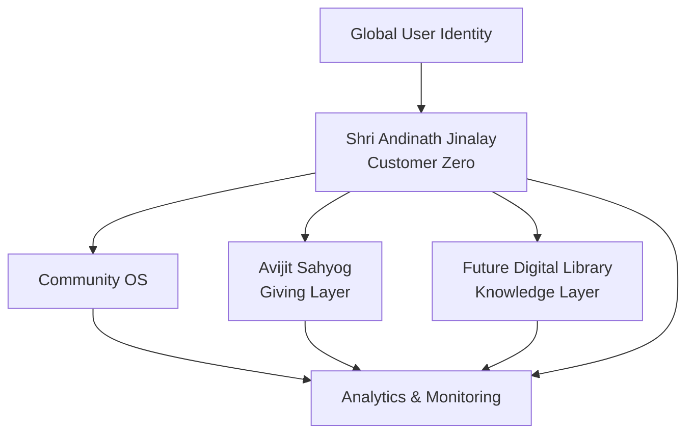

# Shri Andinath Jinalay — Community OS Future Direction

Shri Andinath Jinalay is the **Customer Zero / reference temple experience** for the broader Community OS strategy.

The site/app should remain focused on an excellent temple and devotee experience while providing a realistic environment to validate reusable platform capabilities.

## Ecosystem direction

**Community + Giving + Knowledge + Identity + Intelligence**

## Future Digital Library

The future library is a platform capability, not a requirement to turn this temple site into an ebook application immediately.

The proposal includes:
- Monthly subscription model
- 45 free reading minutes per user per month initially
- Paid access after the free allowance according to configurable entitlements
- Individual book/content purchases where applicable
- Free, sponsored and organization-provided access
- World-class reading UX comparable to modern reading applications
- Progress, bookmarks, highlights, notes, search and multilingual content
- Future source-grounded Jain Knowledge AI using authorized content

## Role of this repository

This repository can serve as a reference implementation and product laboratory for temple-specific experience, content, events, galleries, forms, analytics instrumentation and integration with shared platform capabilities.

Reusable business logic should move toward the Community OS rather than being duplicated across individual temple sites.

## Architectural rule

Do not prematurely implement the full ecosystem here. Keep the temple experience clean and integration-ready, with explicit boundaries between temple presentation, community services, giving, knowledge and analytics.
